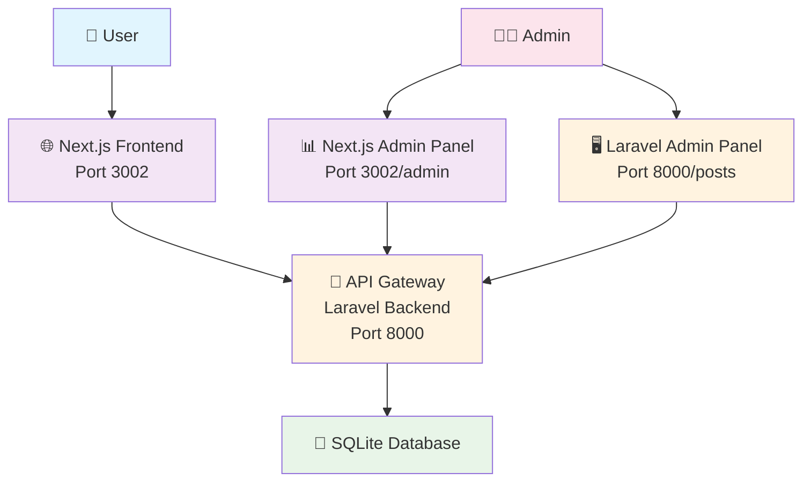
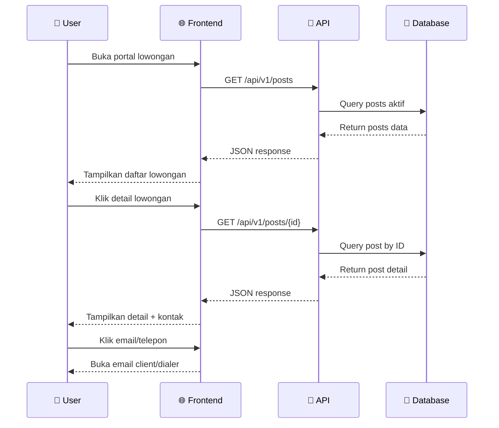
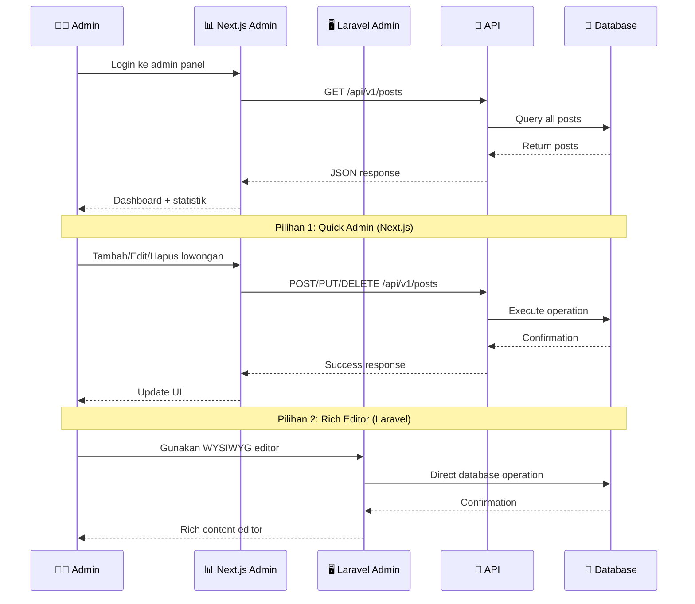
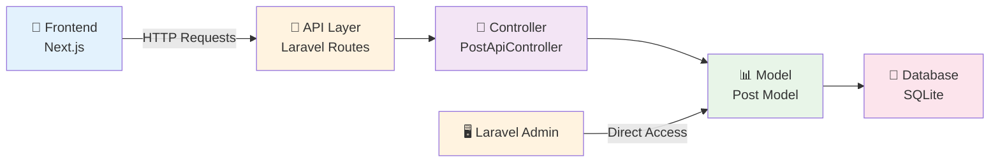
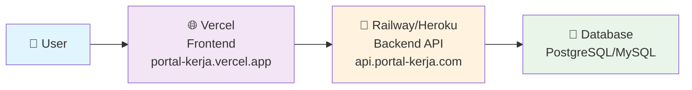

# 🚀 Portal Lamaran Kerja

<p align="center">
  
  
  
  
  
</p>

Platform modern untuk mencari dan mengelola lowongan kerja. Dibuat dengan arsitektur **API-First** menggunakan Laravel sebagai backend dan Next.js sebagai frontend yang powerful dan responsive.

---

## 📋 Daftar Isi

- [✨ Fitur Utama](#-fitur-utama)
- [🏗️ Arsitektur Sistem](#️-arsitektur-sistem)
- [🚀 Quick Start](#-quick-start)
- [📍 URL & Endpoint](#-url--endpoint)
- [🔄 Alur Sistem](#-alur-sistem)
- [💻 Tech Stack](#-tech-stack)
- [📖 Dokumentasi API](#-dokumentasi-api)
- [🎨 Tampilan](#-tampilan)
- [🛠️ Development](#️-development)
- [📝 Contributing](#-contributing)

---

## ✨ Fitur Utama

### 🏠 **Portal Publik**
- 📋 **Daftar Lowongan**: Browse semua lowongan aktif dengan pagination
- 🔍 **Search & Filter**: Cari berdasarkan posisi, perusahaan, atau lokasi
- 📄 **Detail Lowongan**: Informasi lengkap dengan kontak langsung
- 📧 **Contact Integration**: Email & telepon terintegrasi langsung
- 📱 **Responsive Design**: Optimal di desktop, tablet, dan mobile

### 👨‍💼 **Admin Panel (Dual System)**
- 🎯 **Next.js Admin**: Dashboard modern dengan statistik real-time
- 🖥️ **Laravel Admin**: CRUD lengkap dengan WYSIWYG editor
- ➕ **Create Posts**: Form lengkap untuk menambah lowongan
- ✏️ **Edit Posts**: Update data dengan mudah
- 🗑️ **Delete Posts**: Hapus lowongan dengan konfirmasi
- 📊 **Analytics**: Statistics lowongan aktif/nonaktif

### � **API Integration**
- �🚀 **RESTful API**: Endpoint lengkap untuk semua operasi
- 🔒 **Secure**: Validasi data dan error handling
- 📡 **Real-time**: Data sinkron antar frontend dan backend
- 🎭 **Flexible**: Bisa digunakan untuk mobile app atau integasi lain

---

## 🏗️ Arsitektur Sistem



---

## 🚀 Quick Start

### 📋 **Prerequisites**
- PHP >= 8.2
- Composer
- Node.js >= 18
- NPM atau Yarn

### 🔧 **Installation**

#### 1️⃣ Clone Repository
```bash
git clone <repository-url>
cd "Portal Lowongan Kerja_Laravel"
```

#### 2️⃣ Setup Backend (Laravel)
```bash
# Masuk ke direktori backend
cd backend

# Install dependencies
composer install

# Setup environment
cp .env.example .env
php artisan key:generate

# Setup database & seed data
php artisan migrate:fresh --seed

# Jalankan server
php artisan serve
```
> 🎯 Backend akan berjalan di: **http://127.0.0.1:8000**

#### 3️⃣ Setup Frontend (Next.js)
```bash
# Masuk ke direktori frontend (terminal baru)
cd frontend

# Install dependencies
npm install

# Jalankan development server
npm run dev
```
> 🎯 Frontend akan berjalan di: **http://localhost:3002**

### ⚡ **One-Command Start**
```bash
# Terminal 1 - Backend
cd backend && php artisan serve

# Terminal 2 - Frontend
cd frontend && npm run dev
```

---

## 📍 URL & Endpoint

### 🌐 **Frontend URLs**
| Halaman | URL | Deskripsi |
|---------|-----|-----------|
| 🏠 Home | `http://localhost:3002` | Landing page dengan daftar lowongan |
| 📋 Jobs | `http://localhost:3002/jobs` | Halaman daftar lowongan |
| 📄 Job Detail | `http://localhost:3002/jobs/[id]` | Detail lowongan dengan kontak |
| 👨‍💼 Admin Dashboard | `http://localhost:3002/admin` | Dashboard admin dengan statistik |
| 📝 Admin Posts | `http://localhost:3002/admin/posts` | Kelola lowongan |
| ➕ Create Post | `http://localhost:3002/admin/posts/create` | Tambah lowongan baru |
| ✏️ Edit Post | `http://localhost:3002/admin/posts/[id]/edit` | Edit lowongan |
| 👁️ View Post | `http://localhost:3002/admin/posts/[id]` | Preview lowongan admin |

### 🖥️ **Backend URLs**
| Halaman | URL | Deskripsi |
|---------|-----|-----------|
| 🏠 Home | `http://127.0.0.1:8000` | Redirect ke Laravel admin |
| 📋 Laravel Admin | `http://127.0.0.1:8000/posts` | CRUD lowongan dengan WYSIWYG |
| ➕ Create (WYSIWYG) | `http://127.0.0.1:8000/posts/create` | Form dengan rich text editor |
| ✏️ Edit (WYSIWYG) | `http://127.0.0.1:8000/posts/[id]/edit` | Edit dengan rich text editor |

### 🔌 **API Endpoints**
| Method | Endpoint | Deskripsi |
|--------|----------|-----------|
| GET | `/api/v1/posts` | Daftar lowongan (dengan pagination) |
| GET | `/api/v1/posts/{id}` | Detail lowongan berdasarkan ID |
| POST | `/api/v1/posts` | Tambah lowongan baru |
| PUT | `/api/v1/posts/{id}` | Update lowongan |
| DELETE | `/api/v1/posts/{id}` | Hapus lowongan |

---

## 🔄 Alur Sistem

### 👤 **User Journey (Portal Publik)**


### 👨‍� **Admin Journey (Kelola Lowongan)**


### 📡 **Data Flow Architecture**


---

## 💻 Tech Stack

### 🖥️ **Backend**
- **🔴 Laravel 11**: PHP framework dengan Eloquent ORM
- **💾 SQLite**: Database ringan untuk development
- **🔌 RESTful API**: Clean API architecture
- **✅ Validation**: Request validation & error handling
- **📝 Trix Editor**: WYSIWYG editor untuk content

### 🌐 **Frontend**
- **⚡ Next.js 15**: React framework dengan App Router
- **📘 TypeScript**: Type safety untuk development
- **🎨 Tailwind CSS**: Utility-first CSS framework
- **🔄 React Hooks**: Modern state management
- **📱 Responsive Design**: Mobile-first approach

### 🛠️ **Tools & Utilities**
- **📦 Composer**: PHP dependency management
- **📦 NPM**: Node.js package management
- **🔄 Git**: Version control
- **🎯 VS Code**: Recommended IDE

---

## 📖 Dokumentasi API

### 📋 **GET /api/v1/posts**
Mengambil daftar lowongan dengan pagination

**Query Parameters:**
- `page` (optional): Nomor halaman (default: 1)
- `per_page` (optional): Item per halaman (default: 12)
- `search` (optional): Pencarian berdasarkan judul/perusahaan
- `job_type` (optional): Filter berdasarkan tipe pekerjaan
- `location` (optional): Filter berdasarkan lokasi

**Response:**
```json
{
  "success": true,
  "data": {
    "data": [
      {
        "id": 1,
        "title": "Full Stack Developer",
        "company": "PT Teknologi Maju",
        "location": "Jakarta",
        "job_type": "Full Time",
        "salary_range": "Rp 8.000.000 - Rp 12.000.000",
        "description": "...",
        "requirements": "...",
        "benefits": "...",
        "contact_email": "hr@teknologimaju.com",
        "contact_phone": "021-1234567",
        "deadline": "2025-09-10T00:00:00.000000Z",
        "is_active": true,
        "created_at": "2025-08-10T13:19:43.000000Z",
        "updated_at": "2025-08-10T13:21:06.000000Z"
      }
    ],
    "current_page": 1,
    "total": 10,
    "per_page": 12
  }
}
```

### 📄 **GET /api/v1/posts/{id}**
Mengambil detail lowongan berdasarkan ID

**Response:**
```json
{
  "success": true,
  "data": {
    "id": 1,
    "title": "Full Stack Developer",
    // ... semua field post
  }
}
```

### ➕ **POST /api/v1/posts**
Membuat lowongan baru

**Request Body:**
```json
{
  "title": "Software Engineer",
  "company": "PT ABC",
  "location": "Bandung",
  "job_type": "Full Time",
  "salary_range": "Rp 10.000.000 - Rp 15.000.000",
  "description": "Job description...",
  "requirements": "Requirements...",
  "benefits": "Benefits...",
  "contact_email": "hr@abc.com",
  "contact_phone": "022-1234567",
  "deadline": "2025-12-31",
  "is_active": true
}
```

---

## 🎨 Tampilan

### 🏠 **Portal Publik**
- **Hero Section**: Pencarian dan filter lowongan
- **Job Cards**: Grid layout dengan informasi singkat
- **Detail Page**: Informasi lengkap dengan tombol kontak
- **Responsive**: Optimal di semua device

### 📊 **Admin Dashboard**
- **Statistics Cards**: Total lowongan, aktif, nonaktif
- **Quick Actions**: Shortcut ke fitur utama
- **Job Management**: Tabel dengan aksi CRUD
- **Modern UI**: Clean dan user-friendly

---

## 🛠️ Development

### 🏃‍♂️ **Running in Development**

**Backend Development:**
```bash
cd backend
php artisan serve --host=0.0.0.0 --port=8000
```

**Frontend Development:**
```bash
cd frontend
npm run dev -- --port 3002
```

### 🧪 **Testing**

**Backend Testing:**
```bash
cd backend
php artisan test
```

**Frontend Testing:**
```bash
cd frontend
npm run test
```

### 📦 **Build for Production**

**Backend:**
```bash
cd backend
composer install --optimize-autoloader --no-dev
php artisan config:cache
php artisan route:cache
php artisan view:cache
```

**Frontend:**
```bash
cd frontend
npm run build
npm start
```

### 🔧 **Environment Variables**

**Backend (.env):**
```env
DB_CONNECTION=sqlite
DB_DATABASE=/path/to/database.sqlite
```

**Frontend (.env.local):**
```env
NEXT_PUBLIC_API_URL=http://127.0.0.1:8000/api/v1
```

---

## 👥 **Default Accounts**

### 🔐 **Admin Laravel**
- **Email**: `admin@portalkerja.com`
- **Password**: `password123`

---

## 🚀 **Deployment**

### 🌐 **Frontend Deployment (Vercel)**

#### 📋 **Prerequisites**
- GitHub repository: `BayuPratama7/Portal-Lamaran-Kerja-IFITASK`
- Vercel account connected to GitHub

#### 🔧 **Vercel Deployment Steps**
1. **Connect Repository**: 
   - Login ke [Vercel](https://vercel.com)
   - Import project dari GitHub: `BayuPratama7/Portal-Lamaran-Kerja-IFITASK`

2. **Configure Build Settings**:
   ```
   Framework Preset: Next.js
   Root Directory: frontend
   Build Command: npm run build
   Output Directory: .next
   Install Command: npm install
   ```

3. **Environment Variables**:
   ```
   NEXT_PUBLIC_API_URL = https://your-backend-url.com/api/v1
   ```

4. **Deploy**: Klik "Deploy" dan tunggu proses selesai

#### � **Vercel Configuration**
File `vercel.json` sudah disediakan dengan konfigurasi:
- Build Next.js dari folder `frontend/`
- Route semua request ke frontend
- Environment variables untuk API URL

### 🖥️ **Backend Deployment Options**

#### 1️⃣ **Railway** (Recommended untuk Laravel)
```bash
# Install Railway CLI
npm install -g @railway/cli

# Login dan deploy
railway login
railway link
railway up
```

#### 2️⃣ **Heroku**
```bash
# Heroku dengan PHP buildpack
git subtree push --prefix=backend heroku main
```

#### 3️⃣ **Shared Hosting/VPS**
1. Upload folder `backend/` ke server
2. Configure Apache/Nginx virtual host
3. Set document root ke `backend/public/`
4. Update `.env` untuk production:
   ```env
   APP_ENV=production
   APP_DEBUG=false
   APP_URL=https://your-domain.com
   ```

### 🔄 **Full Stack Deployment Architecture**


---

## 📝 Contributing

Kami sangat menghargai kontribusi dari developer lain! 

### 🤝 **How to Contribute**
1. 🍴 Fork repository
2. 🌿 Create feature branch (`git checkout -b feature/amazing-feature`)
3. 💾 Commit changes (`git commit -m 'Add amazing feature'`)
4. 📤 Push to branch (`git push origin feature/amazing-feature`)
5. 🔃 Create Pull Request

### 📋 **Development Guidelines**
- Follow PSR-12 coding standards untuk PHP
- Use TypeScript untuk JavaScript code
- Write descriptive commit messages
- Add tests untuk new features
- Update documentation

---

## 📞 Support & Contact

- 📧 **Email**: bayubys07@gmail.com
- 📖 **Documentation**: (https://github.com/BayuPratama7/Portal-Lamaran-Kerja-IFITASK)

---

<p align="center">
  <strong>🚀 Portal Lamaran Kerja - Connecting Talent with Opportunity</strong>
</p>

<p align="center">
  Made with ❤️, by BayuPratama7
</p>
